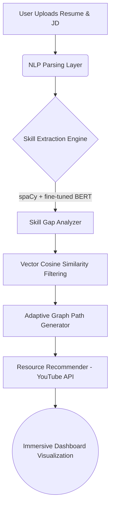

# 🚀 SkillForge: AI-Adaptive Onboarding Engine

<div align="center">
  
  
  
  
  
</div>

## 📖 The Problem
Traditional employee onboarding wastes **up to 40% of an experienced hire's time** by forcing them through redundant compliance and training modules they already know, while simultaneously overwhelming freshers with gaps in their foundational knowledge. 

## 💡 Our Solution
**SkillForge** is an AI-driven adaptive onboarding engine that personalizes training pathways from day one. 
By instantly cross-referencing a candidate's Resume against a target Job Description (JD), our Machine Learning pipeline surgically extracts the exact skill gaps and instantly generates a dynamic, gamified learning roadmap.

---

## 🌟 Key Features
- **🧠 Interactive Skill Gap Map**: A dynamic `react-flow` topology mapping your Missing vs Required proficiency levels, styled with color-coded severity boxes.
- **🗺️ Gamified "Candy Crush" Roadmap**: A highly interactive, S-curve learning pathway.
- **📄 Native 6-Page Document Generation Engine**: A robust exporter powered by `jsPDF` that builds a custom AI-curated syllabus with YouTube links, educator recommendations (CodeWithHarry, Akshay Saini), and weekly study plans.
- **📺 Embedded Video Learning Hub**: Watch tutorials inside the app. Progress is automatically tracked via the YouTube IFrame API, auto-completing modules at 80% watch time!
- **📓 NotebookLM-Style Mentor Drawer**: An integrated AI sliding pane where you can paste URLs or text for instant summaries & quizzes while watching videos.
- **📚 Multi-View Operations Dashboard**: Effortlessly switch between Skill Gaps, Roadmap Mindmaps, Video Hubs, and Progress tracking metrics.

---

## 🏗️ Architecture & Logic Overview



1. **Extraction**: We use advanced NLP to extract arrays of skills from unstructured PDF text.
2. **Gap Analysis**: We perform heavy vector math (Cosine Similarity via Sentence-Transformers) to isolate the delta between the candidate's embeddings and the JD's embeddings.
3. **Graph Pathing**: The isolated missing skills are run through a Directed Acyclic Graph (DAG) topological sort to generate the optimal learning prerequisite order.

---

## 📊 Dataset Citations
We trained and evaluated our NLP systems using the following public resources:
- **O*NET 28.0 Database**: Occupational skill constraints and prerequisite mapping.
- **Kaggle Resume Dataset**: 2,400+ diverse resumes used for NER extraction training.
- **Kaggle Jobs & JD Dataset**: Ground truth for standardizing operational and technical domain roles.

---

## 🛠️ Setup Instructions

### Environment Variables
Copy the `.env.example` file to `frontend/.env` and `backend/.env`. 
```bash
cp .env.example frontend/.env
```

### Backend (Python 3.11+)
```bash
cd backend
python -m venv venv
venv\Scripts\activate   # Windows
pip install -r requirements.txt
uvicorn main:app --reload --port 8000
```

### Frontend (React/Vite)
```bash
cd frontend
npm install
npm run dev
```


