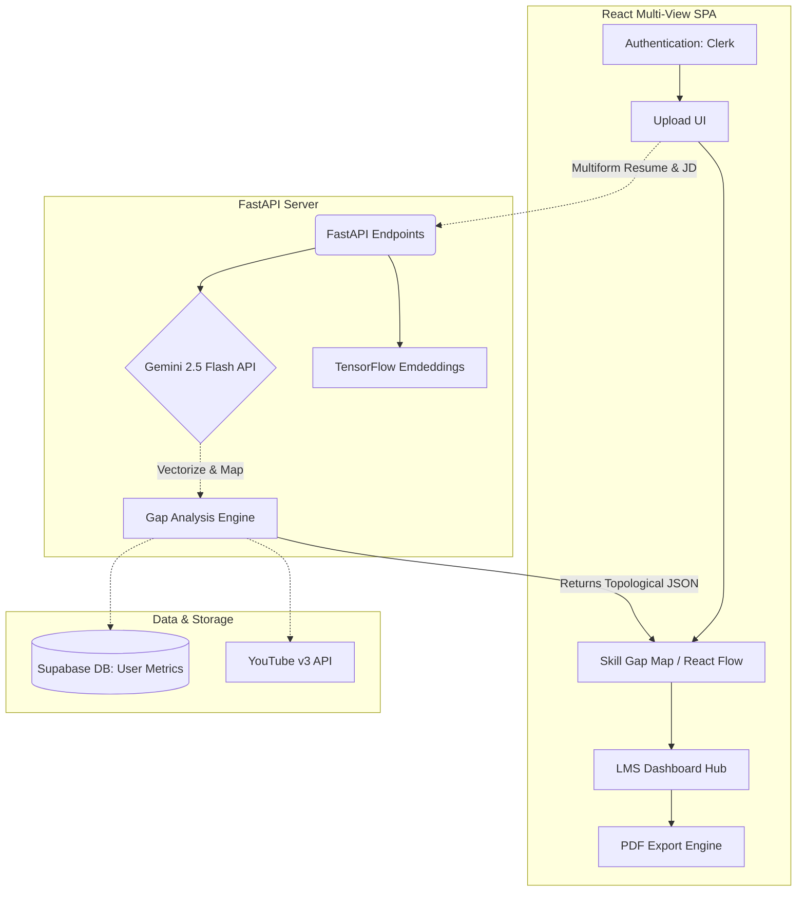
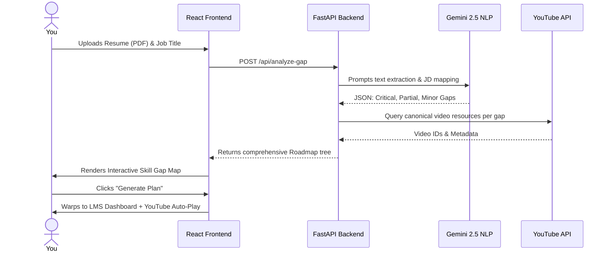

# 🚀 SkillForge: AI-Adaptive Onboarding Engine

<div align="center">
  
  
  
</div>

PPT LINK
https://www.canva.com/design/DAHEgOGoen0/l46G1Us_AT1CsczKEGCZ9A/edit?utm_content=DAHEgOGoen0&utm_campaign=designshare&utm_medium=link2&utm_source=sharebutton

DEMO VEDIO LINK 


## 📖 The Problem
Traditional employee onboarding wastes **up to 40% of an experienced hire's time** by forcing them through redundant compliance and training modules they already know, while simultaneously overwhelming freshers with gaps in their foundational knowledge. The "one-size-fits-all" learning approach is fundamentally broken for modern agile teams. 

## 💡 Our Solution
**SkillForge** is an AI-driven adaptive onboarding engine that personalizes training pathways from day one. 
By instantly cross-referencing a candidate's Resume against a target Job Description (JD), our ML pipeline surgically extracts exact skill gaps and instantly generates a dynamic, gamified learning roadmap tailored uniquely to their career delta.

---

## 🌟 Key Features
- **🧠 Interactive Skill Gap Map**: A dynamic `react-flow` topology mapping your Missing vs Required proficiency levels, styled with color-coded severity boxes (Critical, Partial, Near-Competent).
- **🗺️ Gamified "Candy Crush" Roadmap**: A highly interactive, S-curve learning pathway visualizing your journey from baseline to target role.
- **📄 Native 6-Page Document Generation Engine**: A robust exporter powered by `jsPDF` that builds a custom AI-curated syllabus with YouTube links, educator recommendations, and weekly study plans.
- **📺 Embedded Video Learning Hub**: Watch curated tutorials inside the app. Progress is tracked automatically, advancing you to the next module with celebratory confetti upon completion!
- **📓 NotebookLM-Style Mentor Drawer**: An integrated AI sliding pane where you can paste URLs or text for instant learning summaries & quizzes while watching videos.

---

## 🏗️ Architecture Design (High-Level)




## 🔄 User Workflow Pipeline



---


## 🛠️ Setup Instructions

### Environment Variables
Copy the `.env.example` file to `frontend/.env` and `backend/.env`. 
```bash
cp .env.example frontend/.env
```

### Backend (Python 3.11+)
```bash
cd backend
python -m venv venv
venv\Scripts\activate   # Windows
pip install -r requirements.txt
uvicorn main:app --reload --port 8000
```

### Frontend (React/Vite)
```bash
cd frontend
npm install
npm run dev
```
